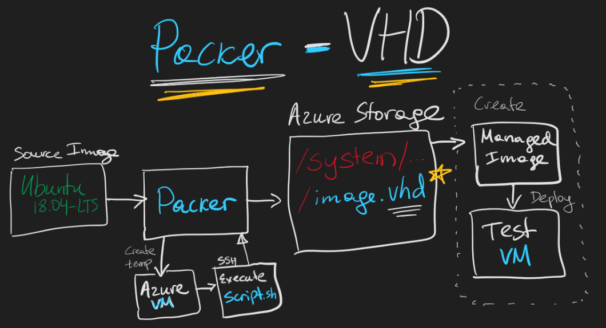

# Create Azure VM Image with Packer - VHD Destination

## Prepare

Download Packer binary <https://www.packer.io/downloads>

Review Packer templates

* [packer-vhd-ubuntu.json](packer-vhd-ubuntu.json)
* [packer-vhd-centos.json](packer-vhd-centos.json)
* [packer-vhd-windows.json](packer-vhd-windows.json)

Set environment variables with credentials of Service Principal that has Contributor role on the Azure subscription

```bash
set AZURE_SUBSCRIPTION_ID=
set AZURE_TENANT_ID=
set AZURE_CLIENT_ID=
set AZURE_CLIENT_SECRET=
```



Create new Azure Storage Account for the VHD or use an existing storage account in the same region as the Packer build (e.g. eastus2 below)

```bash
# Create resource group for storage account
az group create --name avvhd100 --location eastus2

# Create storage account
az storage account create --resource-group avvhd100 --name avvhdstorage100 --location eastus2 --sku Standard_LRS --kind StorageV2 --access-tier Hot
```

**Execute Packer** build to create VHD image in an existing storage account

```bash
# Ubuntu Image
packer build -var location=eastus2 -var storage_resource_group=avvhd100 -var storage_account=avvhdstorage100 packer-vhd-ubuntu.json

# Windows Server Image
packer build -var location=eastus2 -var storage_resource_group=avvhd100 -var storage_account=avvhdstorage100 packer-vhd-windows.json
```

Create SAS for the VHD to use in Partner Center

```bash
# Generate SAS for the container called /system where unmanaged VHD image was captured
az storage container generate-sas --account-name avvhdstorage100 --name system --permissions rl --start "2020-12-01T00:00:00Z" --expiry "2021-01-31T00:00:00Z"

# Append SAS token to the URL of the container to use in Partner Center
# For example: https://avvhdstorage100.blob.core.windows.net/system/Microsoft.Compute/Images/packer/ubuntu1804-osDisk.fbe76a89-9b5f-4240-93b8-331e6be1af98.vhd?SAS_SIGNATURE_HERE
```

Create test VM from the VHD image

```bash
# Create resource group for the managed image and test VM
az group create --name avtestvm100 --location eastus2

# Create managed image from the VHD that Packer generated
az image create --resource-group avtestvm100 --name ubuntu-image --source "https://avvhdstorage100.blob.core.windows.net/system/Microsoft.Compute/Images/packer/ubuntu1804-osDisk.3360fdfb-f29c-4a05-bb55-9e81cd12dd8a.vhd" --location eastus2 --os-type "Linux" --storage-sku "Standard_LRS"

# Create test VM with public IP
az vm create --resource-group avtestvm100 --name ubuntuvm --image ubuntu-image --admin-username azureuser --admin-password "Password@123"
```

Run certification tool against the VM

* [Certification Test Tool for Azure Certified](https://www.microsoft.com/download/details.aspx?id=44299)
* [Using Self-Test API to validate VM images for publishing in Azure Marketplace](https://arsenvlad.medium.com/using-self-test-api-to-validate-vm-images-for-publishing-in-azure-marketplace-e7ac2e0b4d6e)

Delete resource group used for test VM

```bash
az group delete --name avtestvm100
```
